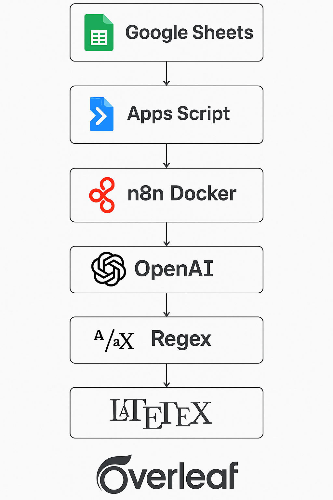

# AI_RA – AI Resume Automation + Job Tracker 🚀  
_Intelligent automation for resume generation, job tracking, and application follow-ups._

---

## 📌 Overview

**AI_RA** is a next-generation AI-powered tool that automates the end-to-end job application experience. It not only generates tailored resumes and cover letters using GPT and LaTeX, but also acts as a smart job tracker—helping you stay organized, proactive, and ahead of the game.

Built using Google Sheets, Apps Script, n8n, and OpenAI, it empowers job seekers to save time and increase their chances of landing interviews.

> ⚠️ LaTeX PDF generation is currently manual; full automation and web app interface coming soon.

---

## 🧠 Features

- 📥 Auto-triggered on editing Google Sheet entries
- 🤖 Uses GPT-4 (via OpenRouter or OpenAI) to extract keywords and generate resume + cover letter
- 📄 Generates LaTeX-compatible content for ATS-ready PDFs
- 📤 Manual PDF generation via Overleaf (automated step in progress)
- 🗃️ **Built-in Job Tracker**: Tracks company, job title, status, application links, and follow-up schedule
- 🕒 Automated resume generation in under 30 seconds

---

## 🛠️ Tech Stack

| Layer             | Technology |
|------------------|------------|
| Input/Trigger     | Google Sheets + Google Apps Script |
| AI Engine         | OpenAI GPT / OpenRouter |
| Automation        | n8n (self-hosted via Docker) |
| Formatting        | Regex + JavaScript |
| Document Output   | LaTeX |
| PDF Generation    | Overleaf (manual, to be automated) |
| Tracker Function  | Spreadsheet-based tracker (web app coming soon) |

---

## 🗂️ Folder Structure

```
AI_RA/
├── README.md
├── LICENSE
├── script.gs
├── resume_template.tex
├── n8n_workflow.json
├── usage_instructions.md
├── images/
│   └── architecture-diagram.png
│   └── n8n_CoverLetterBuilder
│   └── n8n_ResumeBuilder
```

---

## 🧩 Architecture Diagram



```
Google Sheets → Apps Script → Webhook → n8n (Docker) → GPT → Regex → LaTeX → Overleaf (manual PDF) → Google Drive (planned)
```

---

## 🚀 Upcoming Web App Features (v2.0)

We are actively transforming AI_RA into a **full-stack web platform** with:

- 🗃️ Centralized job application dashboard
- 📄 AI-generated resume & cover letter engine
- 🔔 Smart follow-up reminder system
- ☁️ Login & cloud-based data access
- 🧾 PDF resume export via automated LaTeX

More details in [`future_automation.md`](./future_automation.md)

---

## 👤 Created By

**SaiChaitanya Muthyala**  
🌐 [www.saichaitanyamuthyala.com](https://www.saichaitanyamuthyala.com)  
🔗 [LinkedIn](https://linkedin.com/in/saichaitanya-muthyala-3204a71a0) | [GitHub](https://github.com/msaichaitanya735)

---

## 📄 License

This project is licensed under the [MIT License](./LICENSE)

